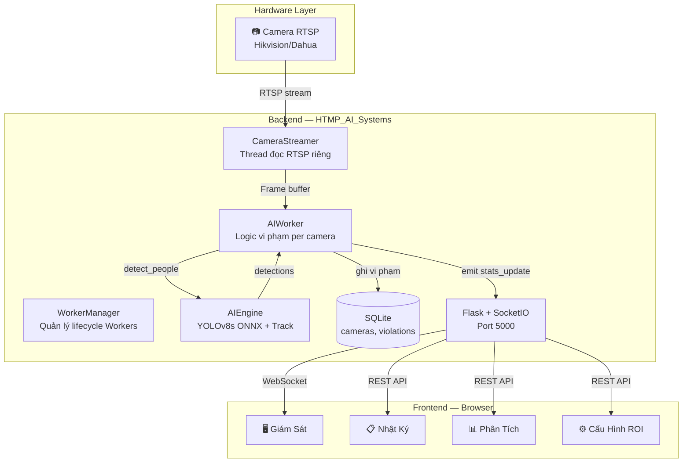

# 🏛️ Kiến trúc Hệ thống — Sentinel Warden AI V5.6

> **Phiên bản**: V5.6 Enterprise Edition (Zero-Spin ONNX)
> **Cập nhật**: 07/04/2026

---

## 🔄 1. Sơ đồ Kiến trúc Tổng thể



---

## 🔄 2. Luồng Dữ liệu Chi tiết

### 2.1 Camera → AI → Dashboard (per worker)

```
Camera RTSP (30fps)
    │
    ▼
CameraStreamer Thread
    └── cv2.VideoCapture (buffer=1, giữ frame mới nhất)
    └── Auto-reconnect nếu mất tín hiệu (sleep 2s retry)
    │
    ▼
AIWorker Thread  [1 Worker = 1 Camera]
    │
    ├── 1) AI Frame Skipping (V5.1)
    │       Chỉ gọi AI khi đủ 1/AI_MAX_FPS giây (mặc định 10 FPS)
    │       cv2.resize(frame, 640×360) → detect_people()
    │
    ├── 2) YOLOv8s ONNX Inference
    │       model.track(persist=True, classes=[0], conf=0.15)
    │       → Trả về: [(box, track_id, is_safe), ...]
    │
    ├── 3) Persistence Buffer Check (chống nháy)
    │       Mất dấu < 5 frame → Giữ lại vị trí cũ
    │       Mất dấu > 5 frame → Xóa khỏi bộ nhớ
    │
    ├── 4) Mask Overlap Scan (ROI Check)
    │       cv2.fillPoly → Mask ROI
    │       np.any(box ∩ mask == 255) → is_safe = True
    │
    ├── 5) Custom NMS (chống đếm trùng)
    │       IoU > 50% → Loại box nhỏ hơn
    │
    └── 6) Logic Vi phạm
            count_in_roi < 1 → bắt đầu đếm giây
            < 1s  → AN TOÀN (đệm chống nháy)
            1s–5s → RỜI VỊ TRÍ
            ≥ 5s  → VI PHẠM → Chụp ảnh → ghi DB khi người quay lại
```

### 2.2 Luồng Ghi Vi phạm

```
Bắt đầu vi phạm (≥ 5s):
    ├── Chụp ảnh frame hiện tại
    ├── Vẽ đường viền ROI (Đỏ), Bounding Box
    ├── Đóng dấu "VI PHAM DANG DIEN RA"
    └── Lưu → data/violations/violation_YYYYMMDD_HHMMSS.jpg

Khi công nhân quay lại:
    └── vio_repo.add(camera_id, filename, duration)
        → INSERT INTO violations (camera_id, time, duration, image)
```

---

## 🧠 3. Chi tiết Các Module

### 3.1 `services/ai_engine.py` — Bộ não AI

| Thành phần | Mô tả |
|---|---|
| **Model (Shared)** | `self.shared_model_instance` — Nạp 1 MÔ HÌNH duy nhất tại WorkerManager, chia sẻ 100% cho mọi Worker. Giảm cực sâu mức ngốn RAM/CPU theo cơ chế singleton. |
| **Zero-Spin Wait** | Cờ `allow_spinning=0` & `OMP_WAIT_POLICY=PASSIVE` ép C++ ngủ khi nhàn rỗi, chặn 38+ triệu vòng lặp Context Switch ảo. |
| **Tracking** | `model.track(persist=True, classes=[0], conf=0.15)` — Cấp Track ID duy nhất per người |
| **Persistence** | `self.memory = {}` — Giữ vết tối đa `max_memory_frames = 5` frame khi mất dấu |
| **ROI Check** | `np.any()` trên Mask pixel — Nhanh hơn kiểm tra điểm rời rạc |
| **NMS** | IoU > 50% → Loại box nhỏ hơn, tránh đếm 1 người thành 2 |
| **Hot Reload** | So sánh `mtime` của `roi_config_{id}.json` mỗi frame → Tự tải lại nếu thay đổi |

### 3.2 `pipelines/camera_stream.py` — Đọc Camera

| Thành phần | Mô tả |
|---|---|
| **Thread riêng** | Daemon thread tách biệt, không block AI Worker |
| **Buffer Size** | Bỏ `nobuffer`, giữ `discardcorrupt` để FFMPEG vứt frame gãy mã H264 mà không gây bão vòng lặp. |
| **FPS Guard** | Hệ thống tự động `sleep` nếu FFMPEG giải mã siêu tốc do vỡ gói dữ liệu, khóa ngưỡng tải cao nhất (Max 30-60 FPS). |
| **Frame ID** | Mỗi frame được đánh ID tăng dần — AIWorker bỏ qua frame trùng (V5.6 Fix) |
| **Auto Reconnect** | Mất kết nối → sleep 2s → retry (vòng lặp vô hạn) |
| **Thread Lock** | `threading.Lock()` bảo vệ `self.frame` khỏi race condition |

### 3.3 `pipelines/ai_worker.py` — Logic Nghiệp vụ

| Thành phần | Giá trị | Mô tả |
|---|---|---|
| **Daemon Thread** | `True` | Tự tắt khi chương trình chính thoát |
| **Bộ đệm 1s** | 1.0s | Vắng < 1s vẫn giữ AN TOÀN (chống nháy) |
| **Ngưỡng VI PHẠM** | `alarm_delay` (từ `.env`) | Mặc định 5s |
| **Dashboard emit** | 0.25s | Gửi data real-time tối đa 4 lần/giây |
| **Diagnostic Log** | Tự động ghi nhận log CPU (`Context Switches`, `ms latency`) | Cảnh báo khi Frame Read hoặc AI tốn CPU |
| **Frame cho Web** | 480×270, JPEG Q40 | Tiết kiệm băng thông |
| **Chống spam CPU** | `sleep(0.01)` cuối mỗi vòng | Tránh chiếm 100% CPU (V5.5 Fix) |

### 3.4 `app/routes.py` — REST API

| Endpoint | Method | Chức năng |
|---|---|---|
| `/api/cameras` | GET | Danh sách tất cả camera |
| `/api/history` | GET | 50 vi phạm gần nhất (`?camera_id=` tùy chọn) |
| `/api/analytics` | GET | Thống kê vi phạm (`?camera_id=` tùy chọn) |
| `/api/config_roi` | POST | Lưu ROI `{camera_id, points}` → `roi_config_{id}.json` |
| `/api/health` | GET | Health check |
| `/violations/<file>` | GET | Serve ảnh bằng chứng từ `data/violations/` |

### 3.5 `db/` — Tầng Database

**Pattern**: SQLAlchemy ORM + Repository Pattern (dễ chuyển SQLite → PostgreSQL sau này)

#### Bảng `cameras`
| Cột | Kiểu | Mô tả |
|---|---|---|
| `id` | INTEGER PK | Tự tăng |
| `name` | TEXT | Tên camera |
| `url` | TEXT UNIQUE | Link RTSP |
| `location` | TEXT | Vị trí (mặc định "Zone A") |
| `is_active` | INTEGER | 1 = Đang dùng |

#### Bảng `violations`
| Cột | Kiểu | Mô tả |
|---|---|---|
| `id` | INTEGER PK | Tự tăng |
| `camera_id` | INTEGER FK | ID camera |
| `time` | TEXT | Thời điểm vi phạm |
| `duration` | REAL | Tổng giây vắng mặt |
| `image` | TEXT | Tên file ảnh bằng chứng |

---

## 🧵 4. Mô hình Đa luồng (Threading)

```
Main Thread — Flask + SocketIO (HTTP + WebSocket)
    │
    ├── Camera 1:  Thread CameraStreamer #1  +  Thread AIWorker #1
    ├── Camera 2:  Thread CameraStreamer #2  +  Thread AIWorker #2
    │   ...
    └── Camera N:  Thread CameraStreamer #N  +  Thread AIWorker #N

AIEngine (YOLOv8s ONNX) — Shared, nạp 1 lần tại WorkerManager
```

**Lưu ý**:
- `async_mode='threading'` trong SocketIO (tương thích OpenCV trên Windows).
- `cv2.setNumThreads(0)` vô hiệu hoá Thread Pool mặc định của OpenCV, tránh hiện tượng sinh CPU ảo.
- Tất cả thread là `daemon` → Tự dừng khi tắt `app.main`.
- `AIEngine` nay được cấu hình `Shared Model` duy nhất. Không còn hiện trạng mỗi Camera sinh ra một tiến trình PyTorch/ONNX mới làm sập hệ thống do đầy C++ threads.

---

## 💾 5. Đồng bộ Camera từ `.env`

Khi khởi động, `app/main.py` thực hiện:
1. **Quét** biến môi trường: `RTSP_URL1` + `CAMERA_NAME1`, ..., đến i=100
2. **Auto-Sync**: Thêm camera mới vào DB nếu chưa có, cập nhật tên nếu URL đã tồn tại
3. **Hard Delete**: Xóa vĩnh viễn camera trong DB không còn khai báo trong `.env`

---

## 🐋 6. Docker & CI/CD

### Dockerfile
```dockerfile
FROM python:3.11-slim
# Cài libgl1, libglib2.0 (OpenCV), curl (healthcheck)
# Cài requirements.txt (bao gồm onnxruntime, opencv-headless)
CMD ["python", "-m", "app.main"]
```

### GitHub Actions (`.github/workflows/docker-build.yml`)
- **Trigger**: Push lên `dev/AnhMinh`
- **Steps**: Checkout → Login GHCR → Build → Push
- **Registry**: `ghcr.io/dunghq23/htmp_ai_systems:dev-anhminh`

### Dependencies (`requirements.txt`)
```
Flask==2.3.3
Flask-SocketIO==5.3.6
numpy<2.0.0
ultralytics>=8.3.0
python-dotenv==1.0.1
opencv-python-headless>=4.8.0
onnxruntime>=1.15.0
lapx>=0.5.5
SQLAlchemy
```

---

*Tài liệu đồng bộ từ source code thực tế — 06/04/2026*
