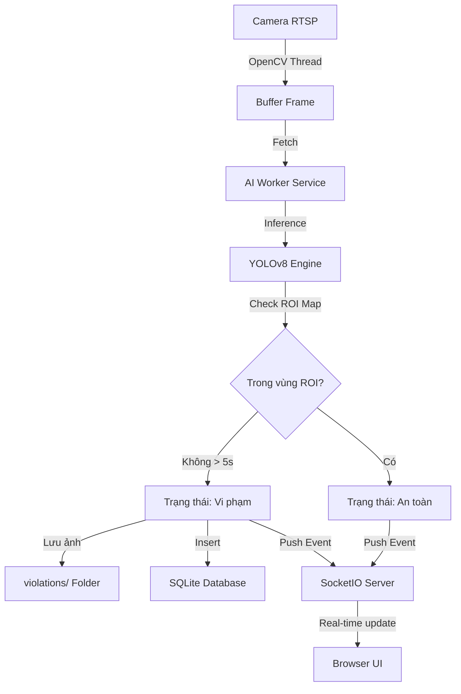

# Kiến trúc Dự án Sentinel Warden

Hệ thống được thiết kế theo mô hình **Modular Micro-service**, tách biệt giữa việc thu thập dữ liệu (Camera), xử lý hình ảnh (AI), lưu trữ (DB) và hiển thị (Web).

## 1. Thành Phần Chính (Core Components)

### 1.1 Camera Streamer (`src/core/camera_stream.py`)
- Sử dụng OpenCV và thư viện FFMPEG để đọc luồng IP Camera (RTSP).
- **Giao thức:** Ép sử dụng **TCP Transport** thay vì UDP để đảm bảo tính ổn định cao nhất trong môi trường Docker, tránh rớt gói tin và hiện tượng đen màn hình.
- Khởi chạy luồng riêng biệt (Daemon Thread) để liên tục cập nhật frame mới nhất vào bộ nhớ đệm (Buffer), đảm bảo không xảy ra hiện tượng "trễ luồng" khi xử lý AI không kịp.

### 1.2 AI Engine (`src/core/ai_engine.py`)
- Sử dụng mô hình **YOLOv8s** (Bản Small) để đạt độ chính xác công nghiệp, phân biệt cực tốt giữa người và các vật thể tĩnh (thùng, máy móc).
- **Tham số tối ưu:** Sử dụng `conf=0.4` và `iou=0.45` cùng kỹ thuật `imgsz=640` để tăng cường khả năng nhận diện công nhân đứng sát nhau.
- **Region of Interest (ROI)**: Sử dụng phương pháp mặt nạ đa giác (Polygon Mask) cho phép định nghĩa chính xác vùng cần giám sát.
- **Foot-point Logic**: Chỉ tính toán sự có mặt dựa trên điểm chân (bottom-center) của bounding box, tăng độ chính xác so với việc tính toán điểm tâm thông thường.

### 1.3 Database Manager (`src/database/db_manager.py`)
- Sử dụng SQLite làm hệ quản trị cơ sở dữ liệu nhẹ (Lightweight).
- Tự động di chuyển dữ liệu từ file JSON cũ sang SQL trong lần chạy đầu tiên (Migration Logic).

### 1.4 AI Worker (`src/services/ai_worker.py`)
- Đây là "Trái tim" của hệ thống. Luồng công việc (Workflow):
    1. Đọc frame từ `CameraStreamer`.
    2. Gửi qua `AIEngine` để nhận diện.
    3. So khớp kết quả với `roi_mask`.
    4. Cập nhật trạng thái vi phạm và ghi bằng chứng qua `DBManager`.
    5. Gửi thông tin trực tiếp tới giao diện Web qua **SocketIO**.

---

## 2. Luồng Dữ Liệu (Data Flow)

---

## 3. Lợi Thế Cạnh Tranh (Competitive Advantages)
1. **Low Latency**: Được tối ưu hóa luồng riêng biệt giữa thu thập và xử lý.
2. **Modularization**: Dễ dàng thay thế mô hình AI (YOLOv10, YOLO11, v.v.) mà không ảnh hưởng tới Web/DB.
3. **Persistance**: Dữ liệu vi phạm được lưu trữ chuyên nghiệp trong database thay vì các file text rời rạc.

---

## 4. Bảo Trì & Phát Triển
Để thêm một tính năng mới (ví dụ: gửi tin nhắn Telegram):
- Tạo một module mới trong `src/services/`.
- Tiêm (Inject) module này vào `AIWorker` trong `app.py`.
- Tiêm (Inject) module này vào `AIWorker` trong `app.py`.
- Lắng nghe các sự kiện vi phạm để thực hiện hành động.

---

## 5. Bảo Mật & Tiêu Chuẩn Công Ty
1. **Quản lý cấu hình**: Sử dụng `.env` để tách biệt cấu hình và mã nguồn. Tệp `.gitignore` đã được thiết lập để ngăn chặn việc rò rỉ thông tin nhạy cảm (như mật khẩu Camera) lên hệ thống Git.
2. **Đóng gói Docker**: Ứng dụng được đóng gói hoàn toàn trong container, tối ưu hóa cho môi trường CPU-only.
   - **Performance Tuning**: Cấu hình `shm_size: 2gb` và `privileged: true` để Docker có đủ bộ nhớ đệm xử lý luồng Video 2K/4K mượt mà.
3. **Tính bền vững (Persistence)**: Cơ sở dữ liệu và ảnh vi phạm được gắn vào `Volumes` bên ngoài container. Đặc biệt, thư mục `./src` và `./` được ánh xạ (Mount) trực tiếp giúp **Đồng bộ hóa mã nguồn tức thì** giữa máy thật và Docker.

---

## 6. Quy trình CI/CD (GitHub Actions)
Hệ thống sử dụng GitHub Actions để tự động hóa:
1. **Kiểm thử (Test)**: Chạy `src/tests/test_basic.py` để đảm bảo AI Engine và Database hoạt động tốt.
2. **Đóng gói (Build)**: Tự động build Docker Image trên máy chủ GitHub (Ubuntu).
3. **Lưu trữ (Push)**: Đẩy Image lên **GitHub Container Registry (GHCR)**. 
   - Địa chỉ Image: `ghcr.io/<tên-người-dùng>/<tên-repo>:latest`
