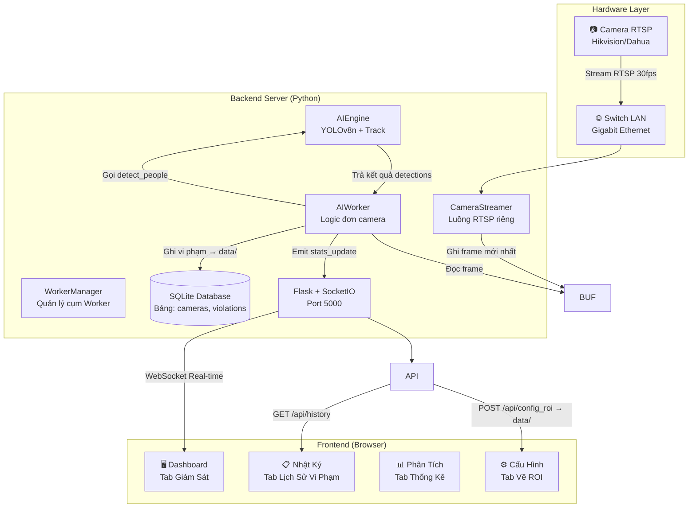

# 🏛️ Kiến trúc Hệ thống — Sentinel Warden AI V5.0

> **Phiên bản**: V5.0 Enterprise Edition  
> **Cập nhật**: 03/04/2026

---

## 📐 1. Cấu trúc Thư mục (Enterprise Layout)

```text
/check_person
│
├─ app.py                <-- (File khởi động Server)
├─ Dockerfile            
├─ docker-compose.yml 
├─ requirements.txt
├─ .env                  
│
├─ src/                  <-- (Mã nguồn chính)
│  ├─ api/               <-- REST API routes
│  ├─ core/              <-- Database, WorkerManager, AI Engine
│  └─ services/          <-- Background Threads (AIWorker)
│
├─ models/               <-- (Chứa pre-trained weights)
│  ├─ yolov8n.pt         
│  └─ yolov8s.pt         
│
├─ data/                 <-- (Dữ liệu động, cần backup thường xuyên)
│  ├─ sentinel.db        <-- Database SQLite chính
│  ├─ roi_config_*.json  <-- Các file cấu hình vùng an toàn của từng camera
│  └─ violations/        <-- Thư mục lưu ảnh bằng chứng vi phạm
│
├─ scripts/              <-- (Các tool chạy độc lập)
│  ├─ migrate_db.py      <-- Script cập nhật database schema
│  ├─ seed_test_data.py  <-- Sinh dữ liệu kiểm thử
│  └─ wifi.py            <-- Tool test băng thông mạng
│
├─ templates/            <-- Frontend (HTML/JS/TailwindCSS)
└─ docs/                 <-- Tài liệu hệ thống
```

---

## 🔄 2. Sơ đồ Kiến trúc Tổng thể



---

## 🔄 2. Luồng Dữ liệu Chi tiết (Data Flow)

### 2.1 Luồng Camera → AI → Dashboard

```
┌─────────────┐    RTSP     ┌─────────────────┐   Frame    ┌─────────────────┐
│   Camera 1  │ ──────────▶ │  AIWorker #1    │ ────────▶  │   SocketIO Ch 1 │
└─────────────┘             └─────────────────┘            └─────────────────┘
                                     │
┌─────────────┐    RTSP     ┌─────────────────┐   Frame    ┌─────────────────┐
│   Camera 2  │ ──────────▶ │  AIWorker #2    │ ────────▶  │   SocketIO Ch 2 │
└─────────────┘             └─────────────────┘            └─────────────────┘
      ...                            │                             ...
┌─────────────┐             ┌─────────────────┐            ┌─────────────────┐
│   Camera N  │ ──────────▶ │  AIWorker #N    │ ────────▶  │   SocketIO Ch N │
└─────────────┘             └─────────────────┘            └─────────────────┘
```
V5.0 sử dụng mô hình **1 Camera = 1 Worker riêng biệt**. Mỗi Worker tự quản lý luồng RTSP, Engine AI và truyền dữ liệu real-time qua SocketIO namespace riêng (`stats_update_{id}`).
                           │  1. Đọc frame từ Buffer                        │
                           │  2. self.engine.detect_people(frame)            │
                           │     ├── YOLOv8s track(persist=True, classes=[0])│
                           │     ├── Persistence Memory Check (5 frames)    │
                           │     ├── Multi-point ROI Scan (5 points)        │
                           │     └── Custom NMS (IoU > 50%)                 │
                           │  3. Logic trạng thái:                          │
                           │     ├── AN TOÀN (count ≥ 1 hoặc vắng < 1s)    │
                           │     ├── RỜI VỊ TRÍ (vắng 1s–5s)              │
                           │     └── VI PHẠM (vắng ≥ 5s → Chụp ảnh + DB)  │
                           │  4. Encode JPEG (640x360, quality=50)          │
                           │  5. Emit qua SocketIO mỗi 0.2s                │
                           └─────────────────────────────────────────────────┘

### 2.2 Luồng Ghi Vi phạm

```
count_in_roi < 1 (liên tục ≥ 5s)
    │
    ▼
_save_violation_snapshot(frame, detections)
    │
    ├── Copy frame gốc
    ├── Vẽ đường viền ROI (Đỏ)
    ├── Vẽ Bounding Box cho mỗi người
    ├── Đóng dấu "VI PHAM DANG DIEN RA"
    └── Lưu → violations/violation_YYYYMMDD_HHMMSS.jpg
    
Khi công nhân quay lại (count_in_roi ≥ 1):
    │
    └── db_manager.add_violation(camera_id, filename, duration)
        └── INSERT INTO violations (camera_id, time, duration, image)
```

---

## 🧠 3. Chi tiết Các Module

### 3.1 `ai_engine.py` — Bộ não AI

| Thành phần | Mô tả |
|---|---|
| **Model** | `YOLO("models/yolov8s.pt", task="detect")` — Small model, 11.1M params, 28.6 GFLOPs |
| **Tracking** | `model.track(frame, persist=True, classes=[0], conf=0.15)` — Track người liên tục, cấp ID duy nhất |
| **Confidence** | `0.15` — Ngưỡng rất thấp để bắt được tư thế khó (cúi, quay lưng) |
| **Persistence** | `self.memory = {}` — Dict lưu {track_id: {detection, frames_missing}}. Max 5 frame |
| **ROI Check** | Multi-point scan ở tỉ lệ `[1.0, 0.8, 0.6, 0.4, 0.2]` trên trục Y của Bounding Box |
| **NMS** | Custom overlap check: IoU > 50% → Loại box nhỏ hơn |
| **Hot Reload** | So sánh `mtime` của `roi_config.json` mỗi frame. Nếu file thay đổi → Tự động tải lại ROI |

### 3.2 `camera_stream.py` — Đọc Camera

| Thành phần | Mô tả |
|---|---|
| **Thread riêng** | Chạy daemon thread tách biệt, không block AI Worker |
| **Buffer Size** | `CAP_PROP_BUFFERSIZE = 1` — Chỉ giữ 1 frame mới nhất, tránh delay |
| **Auto Reconnect** | Nếu `cap.isOpened() == False` → Retry sau 2 giây (vòng lặp) |
| **Thread Lock** | `threading.Lock()` bảo vệ biến `self.frame` khỏi race condition |

### 3.3 `ai_worker.py` — Logic Nghiệp vụ

| Thành phần | Mô tả |
|---|---|
| **Daemon Thread** | `self.daemon = True` — Tự tắt khi chương trình chính thoát |
| **Bộ đệm 1s** | Vắng < 1 giây vẫn giữ trạng thái AN TOÀN (chống nháy cấp business) |
| **Ngưỡng 5s** | Vắng ≥ 5s → Chụp ảnh bằng chứng + Ghi Database |
| **Dashboard 5Hz** | Gửi dữ liệu lên Web mỗi 0.2 giây — Đủ mượt mà cho người giám sát |
| **FPS Realtime** | `1.0 / (elapsed + 0.001)` — Đo tốc độ xử lý thực tế mỗi frame |

### 3.4 `routes.py` — REST API

| Endpoint | Method | Chức năng |
|---|---|---|
| `/api/history` | GET | Trả về 50 vi phạm gần nhất từ Database |
| `/api/config_roi` | POST | Nhận tọa độ ROI từ Web, lưu vào `roi_config.json` (≥ 3 điểm) |
| `/api/health` | GET | Health check cho Docker Healthcheck |
| `/violations/<file>` | GET | Phục vụ ảnh bằng chứng từ thư mục `violations/` |

---

## 🧵 4. Mô hình Đa luồng (Threading Model)

```
┌─────────────────────────────────────────────────┐
│                 Main Thread                      │
│         Flask + SocketIO Server                  │
│         (Xử lý HTTP + WebSocket)                │
└─────┬───────────────────────────┬───────────────┘
      │                           │
      ▼                           ▼
┌─────────────────┐    ┌──────────────────────┐
│  Thread #1      │    │  Thread #2           │
│  CameraStreamer │    │  AIWorker            │
│  ─────────────  │    │  ──────────────────  │
│  Đọc RTSP liên  │    │  Đọc frame → AI →   │
│  tục, lưu vào   │    │  Logic vi phạm →    │
│  buffer         │    │  Emit Dashboard     │
└─────────────────┘    └──────────────────────┘
```

**Lưu ý quan trọng**: 
- `async_mode='threading'` trong SocketIO (thay vì eventlet/gevent) để tương thích hoàn toàn với OpenCV trên Windows.
- Cả 3 thread đều là `daemon` → Khi tắt `app.py` (Ctrl+C), tất cả tự dừng.

---

## 💾 5. Cấu trúc Database

### Bảng `cameras` (SQLite)
Quản lý danh sách thiết bị.

| Cột | Kiểu | Mô tả |
|---|---|---|
| `id` | INTEGER | Khóa chính |
| `name` | TEXT | Tên máy (Máy hàn, Kho bãi...) |
| `url` | TEXT | Link RTSP |
| `is_active` | INTEGER | 1 = Đang dùng, 0 = Ngừng (Mặc định: 1) |

### Bảng `violations` (SQLite)
Lưu nhật ký vi phạm.

| Cột | Kiểu | Mô tả |
|---|---|---|
| `id` | INTEGER | Tự tăng |
| `camera_id` | INTEGER | ID camera (FK) |
| `time` | TEXT | Thời điểm vi phạm |
| `duration` | REAL | Tổng giây vắng mặt |
| `image` | TEXT | Tên file ảnh bằng chứng |

---

## 🐋 6. Docker & CI/CD

### 6.1 Dockerfile
```dockerfile
FROM python:3.11-slim
# Cài libgl1, libglib2.0 (cho OpenCV), curl (cho healthcheck)
# Cài PyTorch CPU-only (giảm kích thước image)
# Cài requirements.txt (bao gồm opencv-python-headless)
CMD ["python", "app.py"]
```

### 6.2 GitHub Actions (`.github/workflows/docker-build.yml`)
- **Trigger**: Push lên `main` hoặc `master`
- **Steps**: Checkout → Login GHCR → Docker Metadata → Build & Push
- **Registry**: `ghcr.io/anhminhh12/check_people:main`
- **Lưu ý**: Không chạy Unit Test trên CI (đã tối giản để Build luôn thành công)

---

## 🌐 7. Giao diện Web Dashboard

### 4 Tab chính:

| Tab | Chức năng | Dữ liệu |
|---|---|---|
| **Giám Sát** | Camera live + Bounding Box + ROI + Trạng thái + FPS | Real-time qua WebSocket |
| **Nhật Ký** | Bảng lịch sử vi phạm + Ảnh bằng chứng + Thời lượng | REST API `/api/history` |
| **Phân Tích** | Tỉ lệ trực vị trí + Biểu đồ tuần + Tổng giờ rời máy | Dữ liệu mẫu (cần kết nối DB) |
| **Cấu Hình** | Vẽ ROI trên camera live + Panel hướng dẫn 3 bước | REST API `/api/config_roi` |

### Overlay trên Camera Live (Tab Giám Sát):
- **Đường viền ROI**: Xanh lá khi AN TOÀN, Đỏ khi VI PHẠM
- **Bounding Box người**: Xanh lá nếu trong ROI, Vàng nếu ngoài ROI
- **HUD Cảnh báo**: Viền đỏ toàn màn hình khi phát hiện VI PHẠM

---

*Tài liệu được đồng bộ từ source code thực tế — 01/04/2026*
