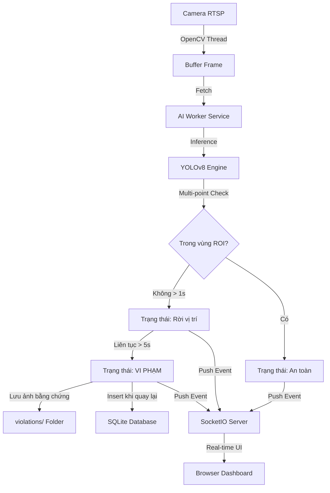

# Kiến trúc Dự án Sentinel Warden (V4.0)

Hệ thống được thiết kế theo mô hình **Modular Micro-service**, tách biệt giữa việc thu thập dữ liệu (Camera), xử lý hình ảnh (AI), lưu trữ (DB) và hiển thị (Web).

---

## 1. Thành Phần Chính (Core Components)

### 1.1 Camera Streamer (`src/core/camera_stream.py`)
- Sử dụng OpenCV để đọc luồng IP Camera (RTSP).
- **Giao thức:** Ép sử dụng **TCP Transport** thay vì UDP để đảm bảo tính ổn định cao nhất, tránh rớt gói tin và hiện tượng đen màn hình trong môi trường công nghiệp.
- Khởi chạy luồng riêng biệt (Daemon Thread) để liên tục cập nhật frame mới vào bộ đệm (Buffer).

### 1.2 AI Engine (`src/core/ai_engine.py`)
- Sử dụng mô hình **YOLOv8** (Tự động chọn bản s - Small hoặc n - Nano) để đạt độ chính xác công nghiệp.
- **Multi-point Vertical Scanning**: Thuật toán quét 4 điểm dọc theo chiều cao người (100%, 90%, 75%, 50%) để kiểm tra sự có mặt trong ROI. Giúp hệ thống hoạt động ổn định kể cả khi chân bị che khuất một phần.
- **Dynamic ROI**: Tự động nạp lại cấu hình `roi_config.json` khi có thay đổi từ phía Web Dashboard mà không cần khởi động lại.
- **NMS bổ sung**: Cơ chế lọc bỏ các bounding box chồng lấn mạnh để tránh việc đếm trùng 1 người thành nhiều người do vật cản.

### 1.3 Database Manager (`src/core/database.py`)
- Sử dụng **SQLite** để lưu trữ lịch sử vi phạm.
- Lưu trữ: Thời gian bắt đầu, thời lượng vắng mặt và đường dẫn ảnh bằng chứng.

### 1.4 AI Worker (`src/services/ai_worker.py`)
- Luồng điều phối chính (Orchestrator):
    1. Đọc frame từ `CameraStreamer`.
    2. Gửi qua `AIEngine` để nhận diện và kiểm tra ROI.
    3. **Confirmation Logic**: Buffer 1 giây trước khi chuyển trạng thái "Rời vị trí" để chống nháy hình.
    4. Ghi bản ghi vi phạm vào bộ nhớ tạm, sau đó "Chốt sổ" ghi vào DB khi công nhân quay lại.
    5. Gửi dữ liệu liên tục (5Hz) tới Web Dashboard qua **SocketIO**.

---

## 2. Luồng Dữ Liệu (Data Flow)

---

## 3. Lợi Thế Kỹ Thuật

1. **Zero Latency Buffer**: Luồng camera độc lập giúp AI luôn xử lý hình ảnh mới nhất tại thời điểm hiện tại.
2. **Detection Robustness**: Thuật toán quét đa điểm và bộ đệm trạng thái 1 giây giúp loại bỏ 99% báo động giả.
3. **Seamless Config**: Cấu hình ROI được đồng bộ hóa tức thì từ Frontend xuống Backend.
4. **Data Persistence**: Ảnh bằng chứng được lưu ở độ phân giải gốc kèm khung nhận diện để dễ dàng đối soát.

---

## 4. Bảo Mật & Tiêu Chuẩn

1. **Quản lý cấu hình**: Tách biệt mã nguồn và cấu hình qua các file JSON/OS ENV.
2. **Đóng gói Docker**: Sẵn sàng đóng gói với tối ưu hóa cho CPU (Windows & Linux).
3. **Volume Mapping**: Đảm bảo dữ liệu SQLite và ảnh vi phạm không bị mất khi Restart Container.
